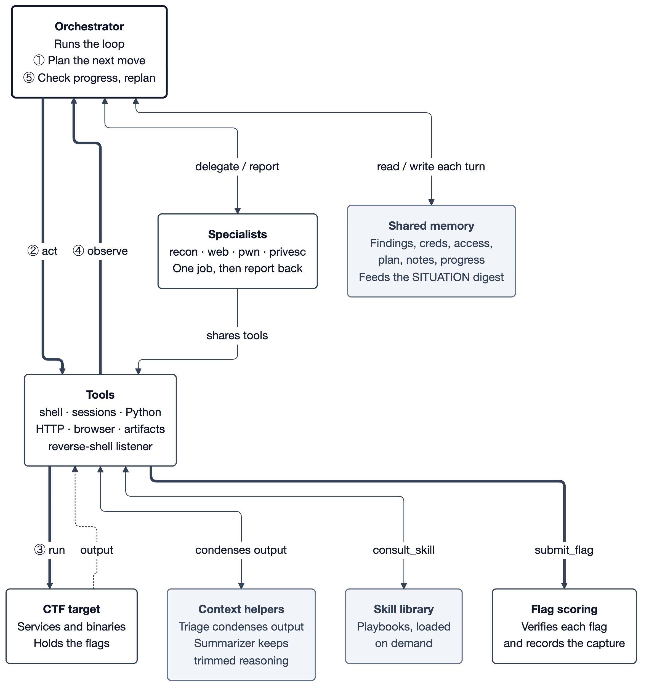

# Tune your Destrier harness

Your mini CTF entry is a configured agent. Edit [config.yaml](../config.yaml) to
change how it thinks and how it spends its time. You can
compete without writing harness code.

Read the [Mini CTF brief](brief.md) for what to expect from TE Box, Milesight,
Atlas, and shop. Each entry shares **60 minutes of cumulative runtime and a
US$10 model-spend budget across all four stages**; neither allowance resets
between stages.

A run is a loop. Follow it 1 to 5: the orchestrator plans, acts through the
tools and specialists against the target, observes what comes back, and replans,
until it submits a flag.



Editable source: [harness-overview.mmd](harness-overview.mmd) (Mermaid). Regenerate
the image with `make diagram`.

## Your task: write the methodology

[config.yaml](../config.yaml) is the file you edit and submit.
[config.participant.yaml](../config.participant.yaml) is a clean reset copy.
The starter preserves its original prompt instructions: objectives, concrete
tool usage, sealed-cell workarounds, specialist guidance, foothold handling and
flag submission. **You write the methodology** in the numbered placeholders.
The reference orchestrator's METHOD, CLOSE THE BOX and DISCIPLINE sections, and
the binary specialist's Workflow, are replaced by explicit fill-in sections.
Recon, web and privesc retain their original instructions and provide additional
numbered spaces for your methodology. Context helper prompts are unchanged.
Supplied support sections also document shared sessions, durable plan/notes,
binary-analysis tools, the emulator and the concurrent race driver. These
capability descriptions remain alongside your own choice and order of actions.

The YAML puts that work first, followed by optional tuning:

| Section | What to do |
| --- | --- |
| **1. Prompts** | Replace the numbered placeholders with your methodology; keep the supplied supporting instructions |
| **2. Models** | Leave each role on `auto`, or choose a permitted model |
| **3. Sampling** | Every role starts at temperature `0.5`; effort is `null` for the provider default. Tune either per role |
| **4. Strategy & context** | Working context settings and automatic strategy hints are already enabled |
| **5. Tools** | Tools are enabled with working timeouts and output limits |

Models remain on `auto`. Sampling has a consistent baseline across all seven
roles: temperature `0.5`, with no explicit reasoning-effort override. `0.5` is the
starter's chosen value, not a universal provider default; `null` leaves an option
out of the request. The gateway retries without a sampling option if a provider
rejects it with a `400` response naming that option.

Context, strategy and tool values retain the original starter settings. These
are explicit working values; deleting a setting can select a different built-in
fallback. Automatic strategy hints and the on-demand skill library still supply
guidance alongside your prompts. You can adjust the hints in section 4 if they
conflict with your methodology.

The main context defaults are a `32000`-token history budget, compaction at `0.75`,
at most `40` recent assistant turns and a minimum of `6` during token trimming.
Orchestrator triage and history summarization remain enabled. Tool availability,
timeouts, output limits and automatic hints are unchanged from the original starter.

```bash
# Save an experiment before resetting it.
cp config.yaml config.my-experiment.yaml
# Reset to the participant starter.
cp config.participant.yaml config.yaml
```

Only `config.yaml` is baked into the image by the current Dockerfile. Rebuild and
submit after editing or restoring it.

## Where to write

Start with `prompts.orchestrator_system`, then fill the four specialist prompts.
The writing spaces are already inside the YAML prompt blocks. Replace the
bracketed text on each `1.`, `2.`, `3.` line and add more steps as needed.
Keep four leading spaces on every line. For example, the orchestrator contains:

```text
    METHOD — WRITE YOUR OWN:
    1. [Write your first step here.]
    2. [Write your next step and when to take it.]
    3. [Write your next step. Add more steps as needed.]
```

It also has numbered sections for your CLOSE THE BOX decision rules and
DISCIPLINE working guidelines. Keep the surrounding toolbox, environment and
completion instructions while filling these sections.

Each YAML `|` block completely replaces that role's base prompt. The bracketed
placeholders are literal prompt text, so replace them before running your entry.
Setting a whole prompt to `""`, `null`, or removing its key restores the full
built-in prompt, including its methodology; it does not produce a blank template.

| Role | Job | Prompt key |
| --- | --- | --- |
| `orchestrator` | Plans, acts, checks progress and assigns specialist work | `prompts.orchestrator_system` |
| `recon` | Maps services and promising attack surfaces | `prompts.recon_system` |
| `web` | Works web weaknesses into access or a flag | `prompts.web_system` |
| `pwn` | Reverses and exploits binaries and custom services | `prompts.pwn_system` |
| `privesc` | Uses a foothold to escalate and read the flag | `prompts.privesc_system` |
| `triage` | Distils large orchestrator tool output | `prompts.triage_system` |
| `summarizer` | Preserves reasoning from trimmed orchestrator history | `prompts.summarizer_system` |

For each role, `models.<role>` chooses its model and
`sampling.temperature.<role>` / `sampling.effort.<role>` tune its generation.
Omitting the `models` section or using `auto` selects the event's default model.
A model priority list such as
`[your-preferred-model, auto]` selects the first permitted entry. An unavailable
choice falls back to the run default. Sampling support depends on the model;
`null` leaves a sampling setting unspecified.

The base prompt is one part of what the agent sees. The harness also provides
the task, tool definitions, a skills index, recent history and the current
**SITUATION** digest. Enabled strategy features can add nudges or refuse certain
tool calls. For example, changing the prompt to encourage more scanning will
not bypass `strategy.focus_after_foothold`'s scan guard; tune that switch too if
you want to change the behavior.

## Connect the knobs to the diagram

| Part | Controls in `config.yaml` | What changes |
| --- | --- | --- |
| Planning and shared memory | `strategy.planning` | Exposes `update_plan` and `update_notes`; the agent maintains durable state in its normal turns |
| Focus and progress | `replan_after_stalls`, `objective_aware`, `win_sequencing`, `coverage_checklist`, `commit_after_creds` under `strategy` | Changes the goals and nudges shown as the run progresses |
| Foothold handling | `focus_after_foothold`, `verify_access`, `auto_loot_on_foothold` under `strategy` | Verifies access, focuses on the held shell and optionally runs a read-only sweep |
| Repetition | `strategy.refuse_repeats` | Refuses unchanged duplicate orchestrator shell/HTTP calls |
| Specialists | `tools.enable_specialists`, each specialist's model/prompt/sampling | Enables bounded delegation; specialists share tools and memory, with separate transcripts |
| Parallel actions | `strategy.parallel_tool_calls` | Overlaps shell/browser calls in one orchestrator turn; batch only independent operations |
| Recent history | `context_token_budget`, `compact_at_context_fraction`, `max_history_turns`, `min_keep_turns` under `strategy` | Balances detail against context size; these are memory limits, not run limits |
| Context helpers | `triage_over_bytes`, `summarize_trimmed`, `progress_log_max_chars`, `fold_self_recaps`, `recap_fold_min_chars` under `strategy` | Distils output, summarizes dropped history and retains long self-recaps as progress notes |
| Reverse engineering | `re_emulate_nudge`, `re_emulate_nudge_after`, `race_lock_in`, `race_build_nudge`, `race_build_nudge_after`, `prove_static_accept_live`, `prove_live_nudge_after` under `strategy` | Nudges toward emulation, acting on confirmed races, and testing a static acceptance against the live daemon |
| Time and resilience | `budget_awareness`, `budget_line_below_seconds`, `retry_headroom_seconds`, `model_call_timeout_seconds` under `strategy` | Changes budget visibility, retries and stream inactivity timeout |
| Tool availability | `tools.enable_*` | Controls which dedicated tools are offered to the model |
| Tool output and waits | `shell_output_limit`, `max_tool_output_per_turn`, `shell_timeout_seconds`, `session_read_timeout`, `python_timeout_seconds` under `tools` | Controls text volume and how long individual operations can wait |
| Skill library | Edit `skills/*.md` directly | Changes the on-demand playbooks behind `consult_skill` |
| Target and scoring | Supplied by the platform | Targets, permitted models, budgets and flag acceptance come from the event |

The YAML comments describe the initial values, units and off switches. Smaller
context/output limits carry less detail; larger values consume more context.
Triage and summarization add model calls, so their model and prompt choices
also affect spending.

## Details that matter during an experiment

- **Specialists run one at a time.** The unused `strategy.parallel_workers`
  field has been removed from the starter. Orchestrator shell/browser calls in a
  batch may overlap; the harness does not detect dependencies between them.
  Shared sessions, Python state, HTTP cookies and KB writes stay serial.
- **Scan and repeat guards apply to the orchestrator.** Specialists receive
  foothold context but do not use the orchestrator's scan/repeat refusal guards.
- **Memory settings have different scopes.** Orchestrator history uses both the
  token estimate and turn limit. Specialist history uses `max_history_turns`.
  Triage and rolling summarization support the orchestrator. Shared KB facts
  remain available when old transcript turns are dropped.
- **Output is processed in stages.** A tool applies its own output limit, then
  the loop scans the returned text for flags. Orchestrator triage may condense
  it, then `max_tool_output_per_turn` caps tool-message characters across that
  turn. This last cap also applies to specialists; it includes truncation notices
  and can leave later messages empty. It resets each turn and does not include
  SITUATION, assistant messages or the automatic foothold sweep. Keep it at `0`
  for no extra cap. Machine-code dumps bypass triage, but output caps still apply.
- **Tool switches affect the model's tool list.** Shell, flag submission, KB
  recording and `consult_skill` are always available. Disabling a dedicated HTTP
  or browser tool does not uninstall command-line programs from the cell.
- **This is not the playtest runtime.** The familiar five YAML sections are the
  same, but `orchestrator` combines the playtest `operator` and `planner` jobs.
  Playtest-only settings such as `initial_recon`, `plan_at_start`, `recon_depth`,
  `give_up_after_stalls`, `stop_on_first_capture` and `max_response_tokens` are
  not implemented here. Unknown keys are ignored.

## Try, check, build

Change one idea at a time: a prompt instruction, a role's model, or a context
setting. Compare capture results and run traces between your saved versions.
Useful comparisons include time to capture, repeated actions, whether a foothold
was actually held, and whether the agent kept the facts it needed.

```bash
$EDITOR config.yaml
python3 -c 'import yaml; yaml.safe_load(open("config.yaml")); print("YAML syntax OK")'
make test
boxr agent build .
boxr agent submit .
```

The syntax check only parses YAML. Use the documented types and ranges: unquoted
`true`/`false` for switches, numeric values for limits, and indented text for
prompts. Invalid numeric values can fail at runtime. `make lint` is optional and requires the separate protocol checkout at `../protocol`.
It validates `harness.yaml`, the platform manifest, rather than participant settings.

`make test` exercises harness behavior and local captures with scripted model
replies. The shell, session and delegation rigs load `config.yaml` through the
entrypoint's config discovery, so these checks exercise your settings. Set
`HARNESS_CONFIG=/path/to/config.yaml` to select another file for a local run.
The suite also verifies all seven YAML prompts, model routing, sampling and tool
switches at their consumer boundaries.

These checks do not measure the quality of your prompt or prove a live event
capture. A platform run is what tests your strategy against the event model and
target. The run has no turn-count limit; platform budgets and full capture govern
normal completion, while persistent gateway failures can also end a run.
